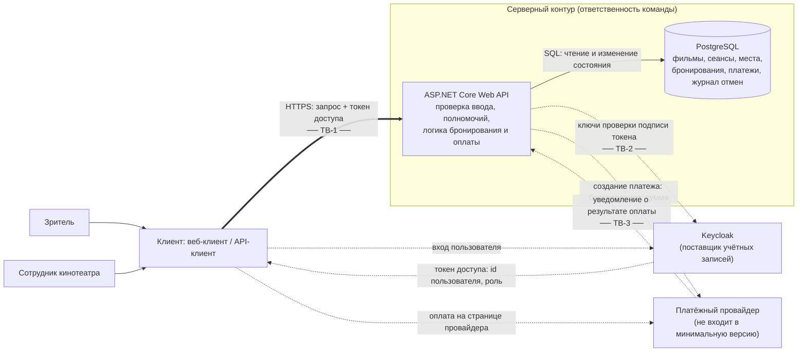

# Модель угроз — Cinema Booking

Рабочая модель для S03.

## Модель продукта

**Точки входа (условный API, точные URL несущественны):**

| Операция | Кто вызывает | Недоверенные данные | Что меняется |
| --- | --- | --- | --- |
| `GET /movies`, `GET /sessions` | любой пользователь | фильтры, `movieId` | ничего |
| `GET /sessions/{id}/seats` | любой пользователь | `sessionId` | ничего |
| `POST /bookings` | зритель | `sessionId`, `seatIds[]`, любые лишние поля тела | бронирование, состояние мест |
| `GET /bookings/my` | зритель | — | ничего |
| `GET /bookings/{id}`, `DELETE /bookings/{id}` | зритель | `bookingId` | состояние бронирования и мест |
| `POST /staff/sessions`, `PATCH /staff/sessions/{id}` | сотрудник | параметры и состояние сеанса | сеанс |
| `PATCH /staff/sessions/{id}/seats/{seatId}` | сотрудник | `sessionId`, `seatId`, доступность | доступность места |
| `DELETE /staff/bookings/{id}` | сотрудник | `bookingId`, `reason` | бронирование, места, журнал |
| `POST /bookings/{id}/payment` *(версия с оплатой)* | зритель | `bookingId`, любые поля о сумме | создаётся платёж у провайдера |
| `POST /payments/notifications` *(версия с оплатой)* | платёжный провайдер (но доступна любому, кто знает адрес) | всё содержимое уведомления: бронирование, сумма, статус, подпись | бронирование становится оплаченным |

Решения о допустимости операции (кто владелец, какая роль, свободно ли место, активен ли сеанс, оплачено ли бронирование) принимает только Web API на основе состояния в БД, проверенного токена и проверенного уведомления провайдера.

**Что уже существует:** паспорт проекта и рабочий набор SR-01…SR-12. Кода пока нет.

**Что пока планируется:**

- минимальная версия: Web API на ASP.NET Core, PostgreSQL, вход через Keycloak, простой клиент или API-клиент (Swagger/Postman); бронирование активно сразу после создания, без оплаты;
- версия с оплатой: внешний платёжный провайдер, состояния бронирования «ожидает оплаты» → «оплачено» / «истекло», срок оплаты (предварительно 15 минут).

**Существенные допущения:**

- Идентификатор пользователя и роль сервер берёт только из проверенного токена доступа, а не из параметров запроса.
- Схема зала (какие места существуют) и цены задаются сотрудником или начальными данными БД и не приходят от зрителя.
- Возврат денег по отменённым оплаченным бронированиям выполняет кинотеатр вне сервиса.
- Конкретный платёжный провайдер не выбран; предполагается, что он подписывает уведомления или позволяет запросить статус платежа со стороны сервера.
- Kafka, Redis, Prometheus/Grafana из стека в основных сценариях пока не участвуют и в модель не включены; при появлении их нужно добавить вместе с новыми потоками.

## Границы доверия

| Граница | Что пересекает | Почему требуется проверка |
| --- | --- | --- |
| TB-1. Клиент → Web API | `sessionId`, `seatIds[]`, `bookingId`, состояние сеанса и места, `reason`, лишние поля тела, токен доступа | Клиент полностью контролируется пользователем: запрос можно отправить напрямую, минуя интерфейс, с любыми значениями и в любом количестве. Скрытая кнопка или проверка в интерфейсе не делает запрос доверенным. |
| TB-2. Keycloak → Web API | токен доступа с идентификатором пользователя и ролью | Токен приходит через клиента; API может доверять его содержимому только после проверки подписи, издателя, получателя и срока действия. |
| TB-3. Платёжный провайдер → Web API (версия с оплатой) | уведомление о результате оплаты: бронирование, сумма, статус | Адрес уведомлений доступен из интернета, и отправить на него запрос может кто угодно; адрес возврата после оплаты проходит через браузер зрителя. Доверять результату оплаты можно только после проверки подлинности уведомления и сверки с данными сервера. |

## Значимые объекты и свойства

Объекты и последствия описаны в [PROJECT.md, раздел 5](PROJECT.md#5-значимые-данные-и-другие-объекты). Для модели важны:

- **бронирование** — конфиденциальность (кто, куда, на какой сеанс) и целостность владельца и статуса;
- **место на сеансе** — согласованность: одно место — не более одного активного бронирования; заблокированное место не бронируется;
- **сеанс и доступность мест** — изменяются только сотрудником;
- **полномочия** — роль сотрудника нельзя получить или подменить со стороны клиента;
- **статус оплаты** — бронирование становится оплаченным только после фактической оплаты полной стоимости;
- **доступность мест для законных зрителей** — места не должны выводиться из оборота злоупотреблением;
- **прослеживаемость привилегированных действий** — отмену чужого бронирования можно связать с сотрудником.

## Угрозы

| ID | Сценарий угрозы | Что нарушается | Граница / точка входа | Связанные SR | Приоритет и обоснование |
| --- | --- | --- | --- | --- | --- |
| T-01 | Зритель B перебирает или подставляет идентификатор чужого бронирования в `GET /bookings/{id}` или `DELETE /bookings/{id}`; сервер проверяет только существование бронирования, но не владельца, — B видит данные бронирования A или отменяет его, и места A уходят другим. | Конфиденциальность и целостность чужого бронирования | TB-1, `GET/DELETE /bookings/{id}` | SR-01 | **Высокий, в приоритетном наборе.** Основной сценарий 2; идентификаторы видны в URL и легко подставляются; последствие — потеря места законным зрителем. |
| T-02 | Зритель добавляет в тело `POST /bookings` поле `userId`/`ownerId` другого пользователя; сервер связывает модель запроса целиком и создаёт бронирование на чужое имя — у A появляются брони, которых он не делал, а B занимает места, не отвечая за это. | Целостность владельца бронирования | TB-1, `POST /bookings` | SR-02 | **Средний.** Реалистично при автоматической привязке модели, но последствие ограничено; закрывается тем же решением, что и T-01 (владелец только из токена). |
| T-03 | Зритель, у которого в интерфейсе нет административных кнопок, напрямую вызывает `PATCH /staff/sessions/{id}`, `PATCH /staff/sessions/{id}/seats/{seatId}` или `DELETE /staff/bookings/{id}`; если API проверяет только факт входа, но не роль, зритель отменяет сеанс, блокирует места или отменяет чужие бронирования. | Полномочия сотрудника; целостность сеансов, мест и бронирований | TB-1, все `/staff/*` | SR-03, SR-04 | **Высокий, в приоритетном наборе.** Сценарий 3; прямой вызов API тривиален; затрагивается весь сеанс и все его бронирования. |
| T-04 | Два зрителя (или один зритель двумя параллельными запросами) почти одновременно отправляют `POST /bookings` на одно и то же место; оба запроса читают «место свободно» до того, как другой запишет бронирование, и оба успешно сохраняются. Каждый по отдельности корректен. | Согласованность состояния места: двойное бронирование | TB-1, `POST /bookings`; конкурентный доступ к БД | SR-06 | **Высокий, в приоритетном наборе.** Нарушает ключевое обещание продукта; на популярных сеансах параллельные запросы — обычная ситуация; решение зависит от выбора модели данных и транзакций, поэтому нужно сейчас. |
| T-05 | Зритель отправляет `POST /bookings` с `seatId`, который синтаксически корректен, но не относится к залу этого сеанса, заблокирован сотрудником, или с `sessionId` отменённого/уже начавшегося сеанса; сервер проверяет только «нет активного бронирования» и создаёт бронь на место, которое не должно предлагаться. | Согласованность состояния мест и сеанса | TB-1, `POST /bookings` | SR-05 | **Высокий, в приоритетном наборе.** Интерфейс показывает только доступные места, но запрос легко изменить; результат — бронь на сломанное место или несуществующий сеанс. |
| T-06 | Зритель бронирует все или большую часть мест популярного сеанса — одним запросом с длинным `seatIds[]` или серией запросов — без намерения прийти. В минимальной версии бронирование бесплатно; в версии с оплатой места бесплатно удерживаются до истечения срока оплаты, и бронирование можно повторять. Вариант с несколькими учётными записями одного человека — остаточный риск (см. ниже). | Доступность мест для законных пользователей | TB-1, `POST /bookings` | SR-09, SR-12 | **Высокий, в приоритетном наборе.** В минимальной версии ничем не сдерживается; влияет на модель данных (лимиты на пользователя и сеанс, срок оплаты). |
| T-07 | Зритель бронирует несколько мест одним запросом, одно из которых уже занято или недоступно; сервер обрабатывает места по одному и сохраняет часть до ошибки — у зрителя остаётся частичное бронирование, а места «зависают». | Согласованность: частичное изменение состояния | TB-1, `POST /bookings` | SR-07, SR-05 | **Средний.** Последствие ограничено, но та же транзакционность нужна для T-04, поэтому учитывается в одном решении. |
| T-08 | Сотрудник отменяет активное бронирование зрителя без причины или по ошибке; запись бронирования просто меняет статус, и потом нельзя установить, кто, когда и почему отменил — зритель не может оспорить отмену. В версии с оплатой отменяется уже оплаченное бронирование. | Прослеживаемость привилегированного действия | TB-1, `DELETE /staff/bookings/{id}` | SR-08, SR-04 | **Средний.** Не позволяет захватить данные, но без журнала невозможно разбирать спорные отмены; дёшево учесть сразу в модели данных. |
| T-09 | Пользователь отправляет токен с изменённым claim роли (`staff`), просроченный токен или токен, выданный для другого приложения; если API принимает токен без проверки подписи, издателя, получателя и срока, зритель получает права сотрудника. | Подлинность пользователя и роли | TB-2, все защищённые операции | SR-03, SR-10 | **Средний.** При штатной интеграции ASP.NET Core с Keycloak проверка включена по умолчанию, но ошибка конфигурации обнуляет защиту T-01, T-03. |
| T-10 | Любой пользователь открывает `GET /sessions/{id}/seats`, и ответ для занятых мест содержит идентификатор или имя владельца бронирования; можно узнать, кто и где будет сидеть. | Конфиденциальность бронирований | TB-1, `GET /sessions/{id}/seats` | SR-01 | **Низкий.** Реалистично при прямой сериализации сущностей, но раскрывается немного данных; проверяется при реализации ответа. |
| T-11 | Зритель, не оплачивая, отправляет на `POST /payments/notifications` поддельное уведомление «оплата успешна» по своему бронированию или открывает адрес возврата с параметром успешной оплаты; если сервер верит уведомлению без проверки подлинности или верит адресу возврата, бронирование становится оплаченным без оплаты. | Целостность статуса оплаты | TB-3, `POST /payments/notifications`, адрес возврата | SR-11 | **Высокий для версии с оплатой.** Прямой ущерб кинотеатру и обход ограничения через оплату; адрес уведомлений открыт из интернета. В приоритетный набор войдёт при начале реализации оплаты: в минимальной версии этой точки входа нет. |
| T-12 | Зритель подменяет в запросе на оплату цену или количество мест, и сервер создаёт платёж на сумму из запроса; либо зритель оплачивает дешёвое бронирование, а уведомление привязывается к другому, более дорогому. Бронирование становится оплаченным за меньшую сумму. | Целостность статуса оплаты и суммы | TB-1, `POST /bookings/{id}/payment`; TB-3 | SR-11 | **Средний.** Реалистично при передаче цены от клиента; закрывается тем же решением, что и T-11 (сумма считается сервером и сверяется с уведомлением). |

**Остаточный риск T-06.** SR-09 ограничивает число мест на одну учётную запись, но не мешает одному человеку зарегистрировать много учётных записей. В минимальной версии этот риск принимается: для захвата зала нужно несколько десятков учётных записей. В версии с оплатой захват становится временным: неоплаченные места возвращаются через срок оплаты (SR-12), а удерживать места дольше можно только оплатив их. Повторное удержание мест после истечения срока остаётся возможным и принимается как остаточный риск; при необходимости его можно ограничивать вне продукта (стоимостью регистрации, антифродом провайдера).

## Приоритетный набор

**T-01, T-03, T-04, T-05, T-06.** При начале реализации оплаты в набор добавляется **T-11**.

Выбраны угрозы, которые затрагивают основные сценарии 1–3, реализуются обычным пользователем через недоверенный ввод на TB-1 без специальных средств и ведут либо к потере законным зрителем места, либо к нарушению главного свойства продукта — одно место не бронируется дважды. Каждая из них влияет на решения, которые придётся принять до реализации: где и как проверяются владелец и роль (T-01, T-03), как устроены транзакция и ограничения БД при бронировании (T-04, T-05), какие лимиты заложить в модель данных (T-06).

T-11 по последствиям высокая, но относится к части продукта, которая не входит в минимальную версию; модель данных минимальной версии должна оставлять место для состояний «ожидает оплаты», «оплачено», «истекло».

T-02, T-07, T-08, T-09 и T-12 имеют средний приоритет: последствия ограничены или они закрываются теми же решениями, что и приоритетные угрозы (T-02 — вместе с T-01, T-07 — вместе с T-04, T-09 — вместе с T-03, T-12 — вместе с T-11). T-10 — низкий.

## Открытые вопросы к S04

- Уточнить конкретные лимиты для SR-09 (число мест в одном бронировании и на пользователя на сеанс) и срок оплаты для SR-12.
- Решить, когда закрывается бронирование на сеанс (за N минут до начала) — влияет на T-05.
- Выбрать платёжного провайдера и способ проверки уведомлений (подпись или запрос статуса платежа сервером) — влияет на T-11.
- При появлении Redis/Kafka в сценариях бронирования добавить их в модель и проверить новые потоки.
