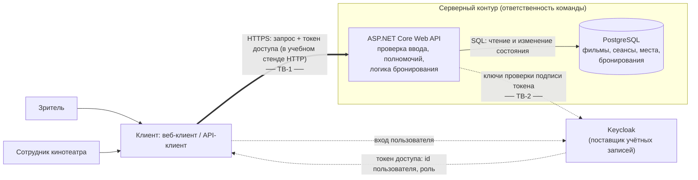

# Модель угроз — Cinema Booking

Рабочая модель к EK1.

## Модель продукта

**Точки входа (реализованный API):**

| Операция | Кто вызывает | Недоверенные данные | Что меняется |
| --- | --- | --- | --- |
| `GET /health` | любой пользователь | — | ничего |
| `GET /movies`, `GET /sessions` | любой пользователь | фильтры, `movieId` | ничего |
| `GET /sessions/{id}/seats` | любой пользователь | `sessionId` | ничего |
| `POST /bookings` | зритель | `sessionId`, `seatIds[]`, любые лишние поля тела | бронирование, состояние мест |
| `GET /bookings/my` | зритель | — | ничего |
| `GET /bookings/{id}`, `DELETE /bookings/{id}` | зритель | `bookingId` | состояние бронирования и мест |
| `POST /staff/sessions`, `PATCH /staff/sessions/{id}` | сотрудник | параметры и состояние сеанса | сеанс |
| `PATCH /staff/sessions/{id}/seats/{seatId}` | сотрудник | `sessionId`, `seatId`, доступность | доступность места |
| `GET /staff/bookings` | сотрудник | `sessionId` | ничего (видны владелец и сведения об отмене) |
| `DELETE /staff/bookings/{id}` | сотрудник | `bookingId`, `reason` | бронирование, места, сведения об отмене |

В окружении разработки дополнительно доступно описание API `GET /openapi/v1.json` без аутентификации.

Решения о допустимости операции (кто владелец, какая роль, свободно ли место, открыт ли сеанс для бронирования, не превышен ли лимит) принимает только Web API на основе состояния в БД и проверенного токена.

**Что уже существует:** паспорт проекта, рабочий набор SR и минимальная запускаемая версия — Web API на ASP.NET Core, PostgreSQL и Keycloak в docker compose (запуск — [паспорт, раздел 10](../PROJECT.md#10-локальный-запуск)). Реализованы D-01–D-03 и автоматические тесты их будущих проверок.

**Что пока планируется:**

- простой веб-клиент для основных сценариев (сейчас API вызывается через curl или API-клиент);
- миграции схемы БД вместо создания схемы при запуске.

**Существенные допущения:**

- Идентификатор пользователя и роль сервер берёт только из проверенного токена доступа, а не из параметров запроса.
- Залы и схема мест задаются начальными данными БД и не приходят от зрителя; операций управления залами в минимальной версии нет.
- Онлайн-оплата и возврат денег в продукт не входят (см. [паспорт, раздел 2](../PROJECT.md#2-граница-продукта)); бронирование бесплатно.
- Kafka, Redis, Prometheus/Grafana в минимальную версию не входят и в модель не включены; при появлении их нужно добавить вместе с новыми потоками.

## Границы доверия

| Граница | Что пересекает | Почему требуется проверка |
| --- | --- | --- |
| TB-1. Клиент → Web API | `sessionId`, `seatIds[]`, `bookingId`, состояние сеанса и места, `reason`, лишние поля тела, токен доступа | Клиент полностью контролируется пользователем: запрос можно отправить напрямую, минуя интерфейс, с любыми значениями и в любом количестве. Скрытая кнопка или проверка в интерфейсе не делает запрос доверенным. |
| TB-2. Keycloak → Web API | токен доступа с идентификатором пользователя и ролью | Токен приходит через клиента; API может доверять его содержимому только после проверки подписи, издателя, получателя и срока действия. |

## Значимые объекты и свойства

Объекты и последствия описаны в [PROJECT.md, раздел 5](../PROJECT.md#5-значимые-данные-и-другие-объекты). Для модели важны:

- **бронирование** — конфиденциальность (кто, куда, на какой сеанс) и целостность владельца и статуса;
- **место на сеансе** — согласованность: одно место — не более одного активного бронирования; заблокированное место не бронируется;
- **сеанс и доступность мест** — изменяются только сотрудником;
- **полномочия** — роль сотрудника нельзя получить или подменить со стороны клиента;
- **доступность мест для законных зрителей** — места не должны выводиться из оборота злоупотреблением;
- **прослеживаемость привилегированных действий** — отмену чужого бронирования можно связать с сотрудником.

## Угрозы

| ID | Сценарий угрозы | Что нарушается | Граница / точка входа | Связанные SR | Приоритет и обоснование |
| --- | --- | --- | --- | --- | --- |
| T-01 | Зритель B перебирает или подставляет идентификатор чужого бронирования в `GET /bookings/{id}` или `DELETE /bookings/{id}`; сервер проверяет только существование бронирования, но не владельца, — B видит данные бронирования A или отменяет его, и места A уходят другим. | Конфиденциальность и целостность чужого бронирования | TB-1, `GET/DELETE /bookings/{id}` | SR-01 | **Высокий, в приоритетном наборе.** Основной сценарий 2; идентификаторы видны в URL и легко подставляются; последствие — потеря места законным зрителем. |
| T-02 | Зритель добавляет в тело `POST /bookings` поле `userId`/`ownerId` другого пользователя; сервер связывает модель запроса целиком и создаёт бронирование на чужое имя — у A появляются брони, которых он не делал, а B занимает места, не отвечая за это. | Целостность владельца бронирования | TB-1, `POST /bookings` | SR-02 | **Средний.** Реалистично при автоматической привязке модели, но последствие ограничено; закрывается тем же решением, что и T-01 (владелец только из токена). |
| T-03 | Зритель, у которого в интерфейсе нет административных кнопок, напрямую вызывает `PATCH /staff/sessions/{id}`, `PATCH /staff/sessions/{id}/seats/{seatId}` или `DELETE /staff/bookings/{id}`; если API проверяет только факт входа, но не роль, зритель отменяет сеанс, блокирует места или отменяет чужие бронирования. | Полномочия сотрудника; целостность сеансов, мест и бронирований | TB-1, все `/staff/*` | SR-03 | **Высокий, в приоритетном наборе.** Сценарий 3; прямой вызов API тривиален; затрагивается весь сеанс и все его бронирования. |
| T-04 | Два зрителя (или один зритель двумя параллельными запросами) почти одновременно отправляют `POST /bookings` на одно и то же место; оба запроса читают «место свободно» до того, как другой запишет бронирование, и оба успешно сохраняются. Каждый по отдельности корректен. | Согласованность состояния места: двойное бронирование | TB-1, `POST /bookings`; конкурентный доступ к БД | SR-05 | **Высокий, в приоритетном наборе.** Нарушает ключевое обещание продукта; на популярных сеансах параллельные запросы — обычная ситуация; решение зависит от выбора модели данных и транзакций, поэтому нужно сейчас. |
| T-05 | Зритель отправляет `POST /bookings` с `seatId`, который синтаксически корректен, но не относится к залу этого сеанса, заблокирован сотрудником, или с `sessionId` отменённого/уже начавшегося сеанса; сервер проверяет только «нет активного бронирования» и создаёт бронь на место, которое не должно предлагаться. | Согласованность состояния мест и сеанса | TB-1, `POST /bookings` | SR-04 | **Высокий, в приоритетном наборе.** Интерфейс показывает только доступные места, но запрос легко изменить; результат — бронь на сломанное место или несуществующий сеанс. |
| T-06 | Зритель бронирует все или большую часть мест популярного сеанса — одним запросом с длинным `seatIds[]` или серией запросов — без намерения прийти. Бронирование бесплатно, поэтому ничто не мешает удерживать места. Вариант с несколькими учётными записями одного человека — остаточный риск (см. ниже). | Доступность мест для законных пользователей | TB-1, `POST /bookings` | SR-08 | **Высокий, в приоритетном наборе.** Без лимитов ничем не сдерживается; влияет на модель данных (лимиты на пользователя и сеанс). |
| T-07 | Зритель бронирует несколько мест одним запросом, одно из которых уже занято или недоступно; сервер обрабатывает места по одному и сохраняет часть до ошибки — у зрителя остаётся частичное бронирование, а места «зависают». | Согласованность: частичное изменение состояния | TB-1, `POST /bookings` | SR-06, SR-04 | **Средний.** Последствие ограничено, но та же транзакционность нужна для T-04, поэтому учитывается в одном решении. |
| T-08 | Сотрудник отменяет активное бронирование зрителя без причины или по ошибке; запись бронирования просто меняет статус, и потом нельзя установить, кто, когда и почему отменил — зритель не может оспорить отмену. | Прослеживаемость привилегированного действия | TB-1, `DELETE /staff/bookings/{id}` | SR-07, SR-03 | **Средний.** Не позволяет захватить данные, но без журнала невозможно разбирать спорные отмены; дёшево учесть сразу в модели данных. |
| T-09 | Пользователь отправляет токен с изменённым claim роли (`staff`), просроченный токен или токен, выданный для другого приложения; если API принимает токен без проверки подписи, издателя, получателя и срока, зритель получает права сотрудника. | Подлинность пользователя и роли | TB-2, все защищённые операции | SR-03, SR-09 | **Средний.** При штатной интеграции ASP.NET Core с Keycloak проверка включена по умолчанию, но ошибка конфигурации обнуляет защиту T-01, T-03. |
| T-10 | Любой пользователь открывает `GET /sessions/{id}/seats`, и ответ для занятых мест содержит идентификатор или имя владельца бронирования; можно узнать, кто и где будет сидеть. | Конфиденциальность бронирований | TB-1, `GET /sessions/{id}/seats` | SR-01 | **Низкий.** Реалистично при прямой сериализации сущностей, но раскрывается немного данных; проверяется при реализации ответа. |

**Остаточный риск T-06.** SR-08 ограничивает число мест на одну учётную запись, но не мешает одному человеку зарегистрировать много учётных записей. Этот риск принимается: для захвата зала нужно несколько десятков учётных записей, а массовые бронирования сотрудник может отменить с указанием причины (SR-03, SR-07). При росте злоупотреблений риск можно снижать вне продукта, например подтверждением учётной записи в Keycloak.

## Приоритетный набор

**T-01, T-03, T-04, T-05, T-06.** Решения для набора — в [проектных решениях](design-decisions.md): D-01 (T-01, T-03), D-02 (T-04, T-05), D-03 (T-06).

Выбраны угрозы, которые затрагивают основные сценарии 1–3, реализуются обычным пользователем через недоверенный ввод на TB-1 без специальных средств и ведут либо к потере законным зрителем места, либо к нарушению главного свойства продукта — одно место не бронируется дважды. Каждая из них влияет на решения, которые придётся принять до реализации: где и как проверяются владелец и роль (T-01, T-03), как устроены транзакция и ограничения БД при бронировании (T-04, T-05), какие лимиты заложить в модель данных (T-06).

T-02, T-07, T-08 и T-09 имеют средний приоритет: последствия ограничены или они закрываются теми же решениями, что и приоритетные угрозы (T-02 — вместе с T-01, T-07 — вместе с T-04, T-09 — вместе с T-03). T-10 — низкий.
